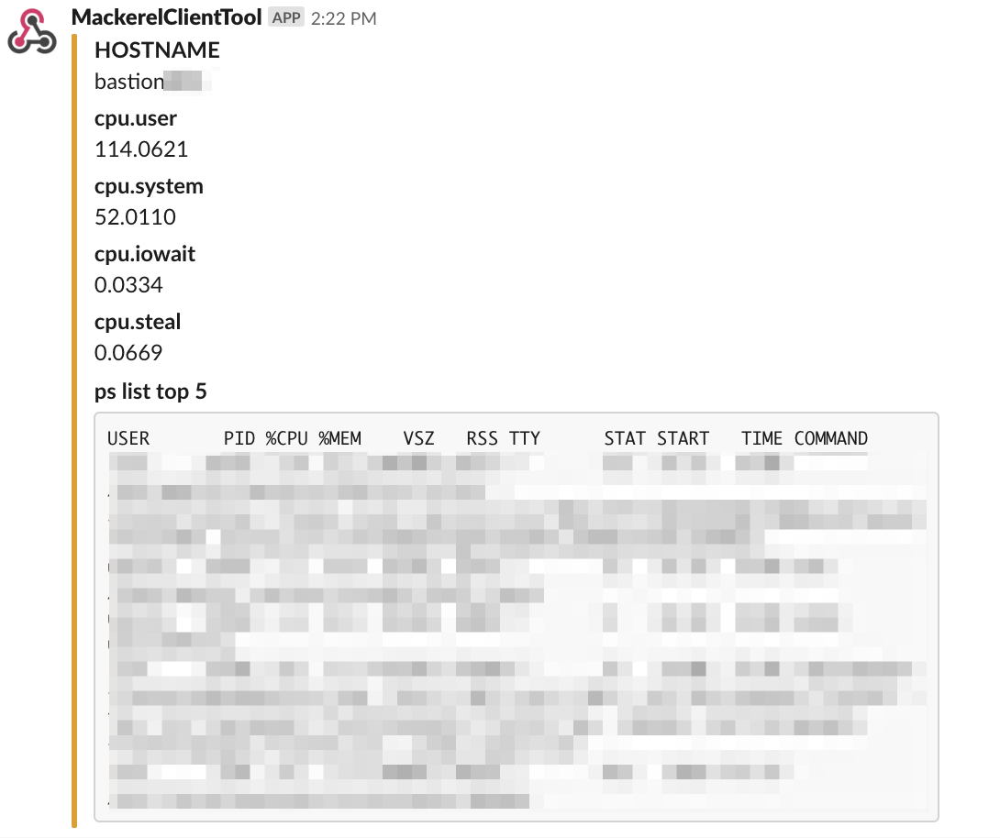
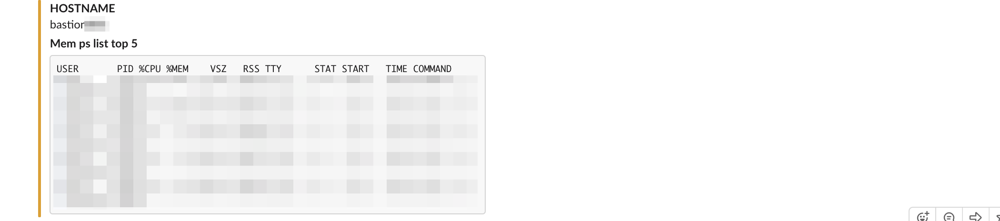

[](https://travis-ci.org/yhidetoshi/mackerelAlertProcListTool)

# mackerelAlertProcListTool

Blog: [MackerelのCPU・Memoryアラート発生時にそれぞれの高負荷なプロセスをSlackに通知するツールを作った](https://yhidetoshi.github.io/2019/06/mackerel%E3%81%AEcpumemory%E3%82%A2%E3%83%A9%E3%83%BC%E3%83%88%E7%99%BA%E7%94%9F%E6%99%82%E3%81%AB%E3%81%9D%E3%82%8C%E3%81%9E%E3%82%8C%E3%81%AE%E9%AB%98%E8%B2%A0%E8%8D%B7%E3%81%AA%E3%83%97%E3%83%AD%E3%82%BB%E3%82%B9%E3%82%92slack%E3%81%AB%E9%80%9A%E7%9F%A5%E3%81%99%E3%82%8B%E3%83%84%E3%83%BC%E3%83%AB%E3%82%92%E4%BD%9C%E3%81%A3%E3%81%9F/)

- 目的
  - MackerelでCPU/Mem使用率のアラートが発生した場合にSlackにCPU/MEM使用率の高いプロセスリストをPostさせる
- 実装
  - `mackerel-client-go` を利用してツールを作成
    - https://github.com/mackerelio/mackerel-client-go
  - mackerel-agentのidをインスタンス内部で取得します。（今回はUbuntuのパスを指定）他のディストリビューションの場合は修正が必要です。  
  - systemdのtimerで1分に1回実行させる
  - アラート発生から３分以内は毎分通知する。(アラートが発生し続けていると何度も通知しないようにするため)
  - Mackerelのアラート一覧に自インスタンスのmackerel-idがあるかチェック
  - 自インスタンスのアラートが存在する場合、アラートの種類が `CPU % / Memory &` で 管理画面の閾値設定値を超えている場合はSlackに以下のコマンド実行結果とホスト名、cpu使用率の内訳をPostする
    - `ps aux --sort -%cpu | head -n 6`
    - `ps aux --sort -%mem | head -n 6`

## Usage

``` 
> $ main -slackurl=<SLACKURL>
```

- `MACKEREL_API_KEY` は systemdで実行するときに環境変数をセットする


## Slack通知の結果

CPUアラート時の通知結果




Memアラート時の通知結果


