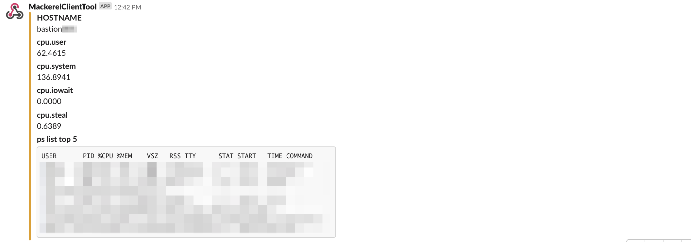

[](https://travis-ci.org/yhidetoshi/mackerelAlertProcListTool)

# mackerelAlertProcListTool

Blog: [MackerelのCPU・Memoryアラート発生時にそれぞれの高負荷なプロセスをSlackに通知するツールを作った](https://yhidetoshi.hatenablog.com/entry/2019/06/09/000000)

- 目的
  - MackerelでCPU/Mem使用率のアラートが発生した場合にSlackにCPU/MEM使用率の高いプロセスリストをPostさせる
- 実装
  - `mackerel-client-go` を利用してツールを作成
    - https://github.com/mackerelio/mackerel-client-go
  - mackerel-agentのidをインスタンス内部で取得します。（今回はUbuntuのパスを指定）他のディストリビューションの場合は修正が必要です。  
  - systemdのtimerで1分に1回実行させる
  - アラート発生から３分以内は毎分通知する。(アラートが発生し続けていると何度も通知しないようにするため)
  - Mackerelのアラート一覧に自インスタンスのmackerel-idがあるかチェック
  - 自インスタンスのアラートが存在する場合、アラートの種類が `CPU % / Memory &` で 管理画面の閾値設定値を超えている場合はSlackに以下のコマンド実行結果とホスト名、cpu使用率の内訳をPostする
    - `ps aux --sort -%cpu | head -n 6`
    - `ps aux --sort -%mem | head -n 6`

## Usage

``` 
> $ main -slackurl=<SLACKURL>
```

- `MACKEREL_API_KEY` は systemdで実行するときに環境変数をセットする


## Slack通知の結果

CPUアラート時の通知結果




Memアラート時の通知結果


